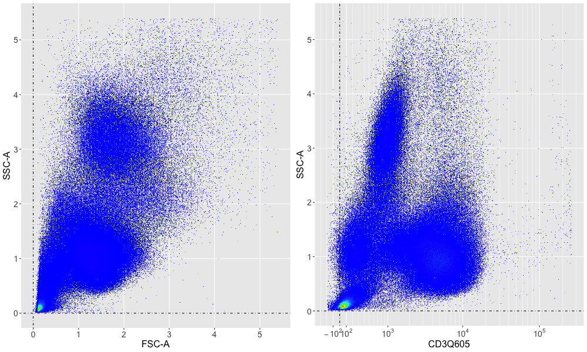
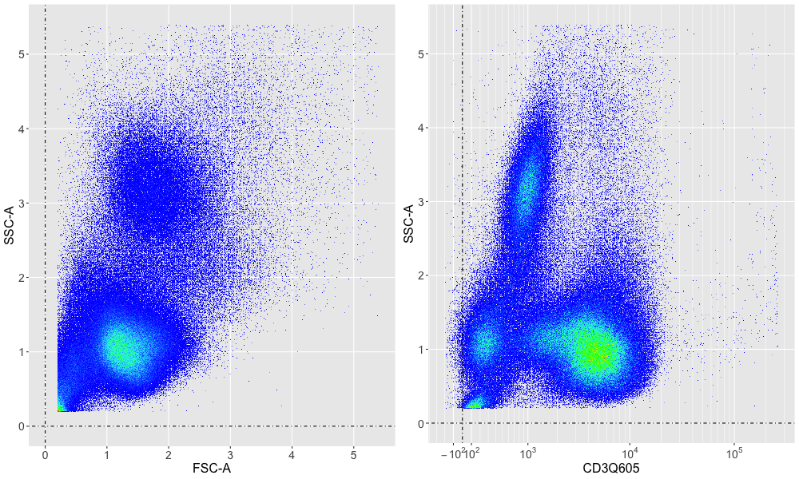
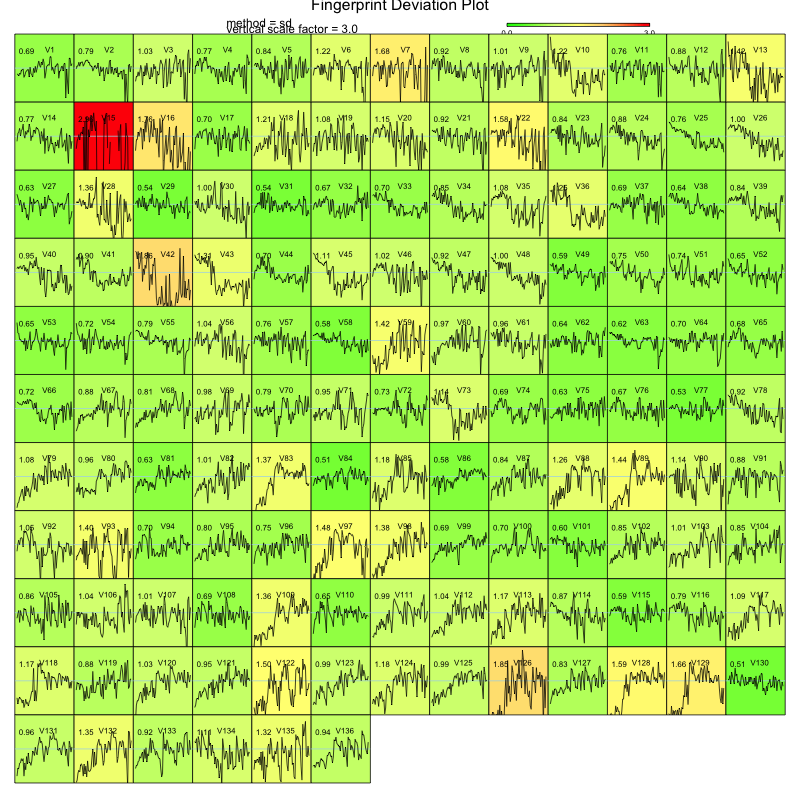

# Clustering
Project for exploration of clustering approaches

## Background
This repository contains Matei's Rmd lecture on clustering.  

I also recommend that you download the Young/Old FlowRepository dataset.  To do so:

1.  Install the FlowRepositoryR package
1.  Using that package, retrieve the __FR-FCM-ZZGS__ dataset
1.  Look at the code in this git repository as suggestion/guidance for how to
QC and pre-gate the data

After that, have fun!  Try FlowSOM.  Think of your own ideas for clustering
and population identification.  Look for T cell subsets that differ significantly
between young and old subjects.

## The Young/Old Dataset
This dataset was create by Rochester Human Immunology Center, David H. Smith Center 
for Vaccine Biology & Immunology, Rochester, NY (USA).  The purpose was to use SWIFT's 
competitive clustering assignment method to measure the differences between PBMC 
sub-populations in Old/Young subjects.  SWIFT is a very nice clustering method, 
implemented in MATLAB, described in [here](http://www2.ece.rochester.edu/projects/siplab/Software/SWIFT.html).  
Unfortunately, since it is implemented in MATLAB, which is a commercially available 
system, you may not be able to run it yourself.  However, you may be able to compare
your results to the published SWIFT results.

This dataset consists of 136 FCS files.  Each file contains on the order of 500k cells
with 15 markers including a live/dead marker.  The panel includes markers to delineate
the usual T cell subsets (CD3, CD4, CD8, CD45RA, CCR7), as well as a few others 
(e.g. PD1, CD14, CD11b, Ki67, CD95, CD127, CD57, CCR4, CD27).  So, it's a realistically
large dataset.  It's not a tiny example set, but it's also not as big as what
you may be collecting in your own labs on modern high-dimensional instrumentation.
Nevertheless, it'll help you get a handle on the challenges of wrangling relatively
large data.

## QC and Gating
There are three files containing my R code in this repo.

1. yo_utils.R
    * This file contains utility functions for reading, gating, etc.
1. survey_data.R
    * Contains code to examine the data for warts, ultimately to be used to eliminate
    data files corrupted by un-correctable artifact.
1. gate_data.R
    * This file applies gating methods worked out in the surveying step, and writes
    gated FCS files to be used as input to downstream clustering workflows.
    __NOTE: this file is deprecated for reasons explained at the end of this
    README file.__

Please feel free to use these as suggestions for your own work.  Below is a summary of
my thought processes as I proceeded on this work. _Apologies for not following some of my
own coding style suggestions.  Old habits are hard to break!_

### Evolution of the code and the thinking behind it
I then started by writing the script __survey_data.R__.  The idea here was to look for any glaring
staining or other technical artifacts that might be too severe to correct - for example
by normalization.

#### Survey the data visually
The first bit of __survey_data.R__ (down to about line 47) was just to make some basic bivariates as a first
peek at the data.  I decided to look at FSC vs SSC and SSC vs CD3.  After manually plotting
the first couple of files, I noticed that the intense peak at very low FSC/SSC
caused the colors of all of the interesting cells to be a boring blue color.  

So I added a pair of static gates at very low scattering signals to better visualize
the more interesting cells (see lines 34-37).  

The resulting figures (one for each FCS file) were written into the pic_base 
directory called raw_*.png.

I had made the decision to use SSC-A, CD3 and LIVEDEAD as
initial pre-gating parameters.

I then had the idea to use FlowFP to perform a more
quantitative survey of lack of conformity of individual samples relative to the
aggregate of all.  I wrote the section starting with the comment on line 51
to accumulate all data into a flowSet.  However, my 16 GB machine ran out of memory when I ran it,
so I realized that I needed to subsample the data (see line 66), randomly selecting
10,000 events from each flowFrame.

I noted that instance #15 was goofy looking.  Going back to the raw bivariates, 
it's clear that this was due to a staining error.  This illustrates the idea that
you may not want to look at _every_ bivariate you generated, but they're nice to
have when it's time to identity the reason behind instances that don't look like
the rest.

#### Pre-gating
At this point it was time to look at the other parameters.  I decided that the way
I would do this would be to first gate T cells, and then fingerprint all of the remaining
parameters.  To do this i needed to write the gating code.  So, I started a new
file called __yo_utils.R__ to contain my pre-gating functions.  Note that for
files containing only function declarations, I like to check the box called
_source on save_, so every time I save the file (which I do frequently) it is sourced,
and if there are syntax errors I'll see them immediately instead of waiting till
the code is executed (at which point I'm likely to be really confused).

I thought a bit, then decided that the gating strategy would be as follows:

1. __gate_debris()__.  These files have a big spike of "debris" at very low FSC and
SSC (you can see an example of this in the plot above).  Let's get rid of it.
1. __gate_clean()__.  Look for "stationary" acquisition.  The assumption here is that
it shouldn't matter at what point during an acquisition an event was detected.  Should
be the same everywhere.  I selected SSC-A and one parameter off of each laser, with
the idea that if there was a fluidics hiccup I'd see it, and if there was a laser
hiccup on any laser I'd see that too.  By the way, if you look at the images of this "cleaning"
process you will note that at the beginning of each acquisition there's a lot of jumping
about, and sometimes at the end (or middle) as well.  Also, looking at the FCS filenames there's
a hint that these data were acquired from 96-well plates.  Putting 2 + 2 together, I surmise that
there's a strong need to clean data when automatic plate sampling is done.  Just sayin'...
1. __gate_singlet()__.  I used a trick I learned from Derrick Jones that just uses FSC-W
and SSC-W.  It's sort of a short-cut from the usual.
1. __gate_live()__.  I looked for the LIVEDEAD- and CD3+ blob.  This took a little fiddling
to get it to work for all files - in particular I pre-gated to allow blob.boundary()
to be able to ignore some of the junk down low.

The loop from lines 100-133 in __survey_data.R__ applied the gating strategy and stored a sub-sampled
version of the result.  

#### Final QC decisions
After gating I repeated the flowFP QC calculation,
this time _including all fluorescence parameters not used for gating_.  This shows some other 
instances (beyond #15 that we've already mentioned) that may be dubious.  For example,
look at the bivariates for instances 133, 135, 93, etc.  I think there were some compensation
problems with these.  You may (or may not) decide to ditch them in favor of having
the cleanest possible data set.  Alternatively you may decide to keep them to maintain
statistical power, with the proviso that some results might be contaminated with
artifact.

#### An example of what __NOT__ to do
I then wrote a new script, __gate_data.R__.  This script repeated the gating
calculations (without re-writing the gating figures), and output gated FCS files
to be used downstream. _However, this is a dubious approach_, since whenever you copy 
and paste code, you run the risk of going back to the original code, editing it to 
correct some mistake, and then __forgetting__ to correct the copy.  So, to show
you what I consider a best practice, I went back and added the gated FCS output
to __survey_data.R__ (see lines 116-118).

#### Censoring decisions and implementation
Note that I would advise that you  __censor__ any instances that do not
meet your QC criteria.  A convenient way to do this is to create a spreadsheet
that contains one row for each FCS file.  It has a column, labeled for example
"valid".  Each file that you like gets a value of 1 for example, and files that
you don't like get a value of 0 (it doesn't matter what these values are, but
your downstream code will skip over the invalid files).  You can populate the
valid column in your code, but you can also manually edit it as you see fit,
using excel for example.  See the last few lines
of __survey_data.R__ to see how to get started with this.

Hope this gives you some insight into how I go about starting a project!

